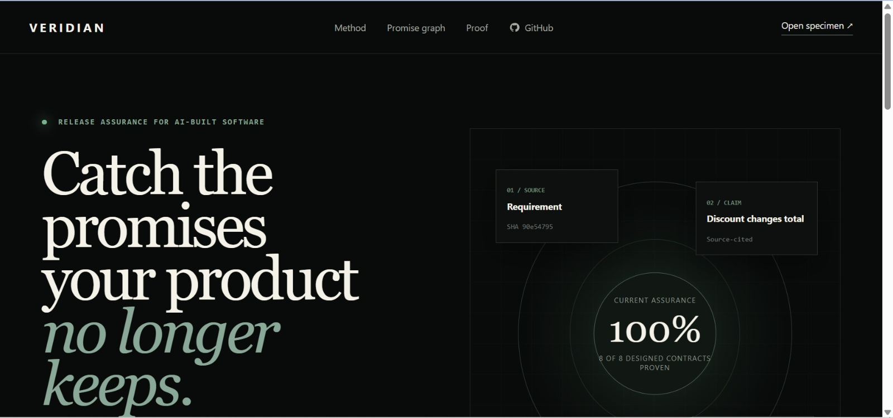
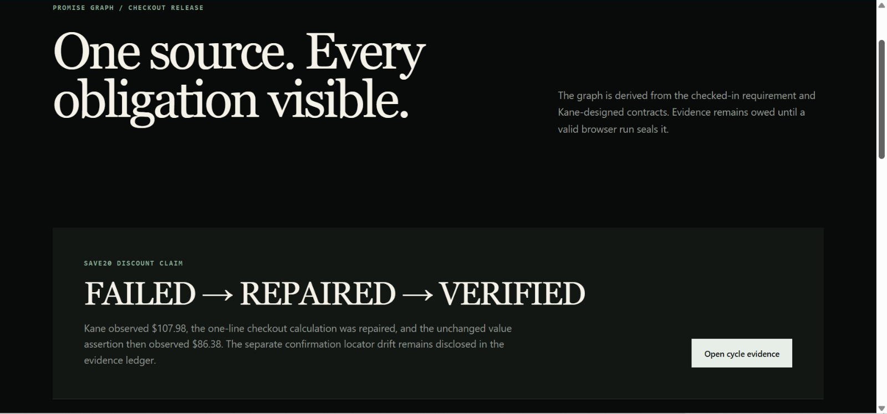
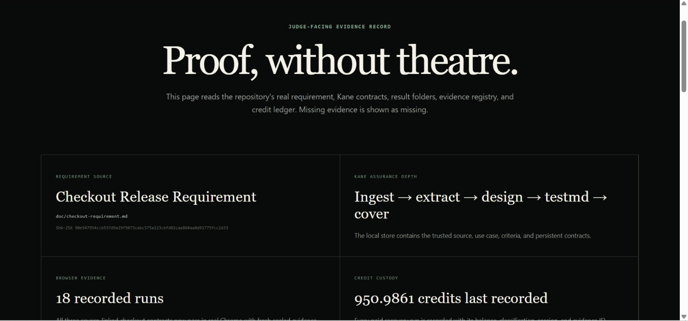
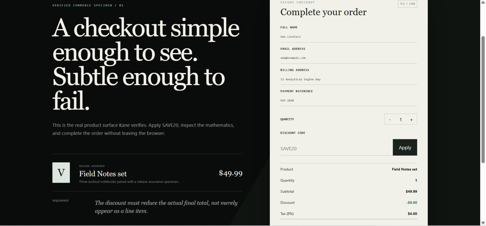
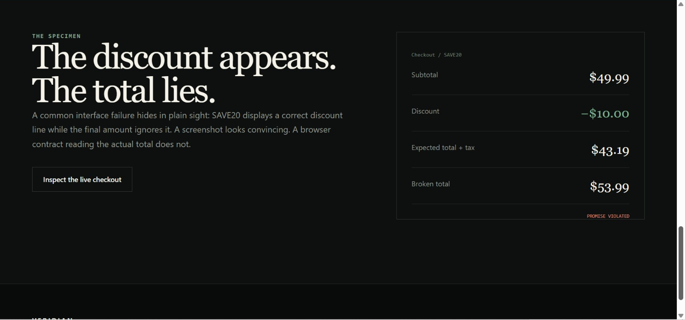
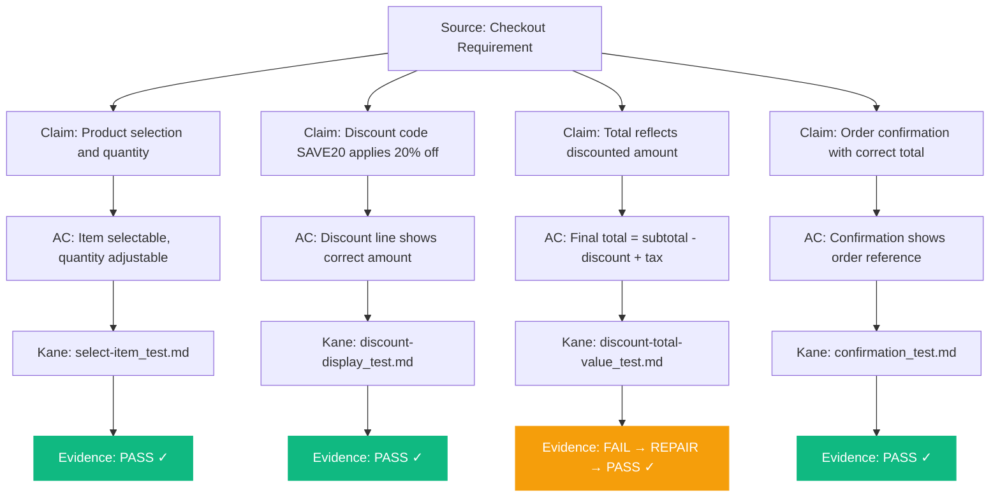
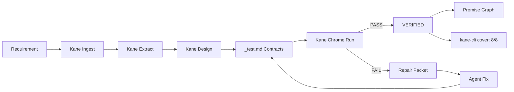
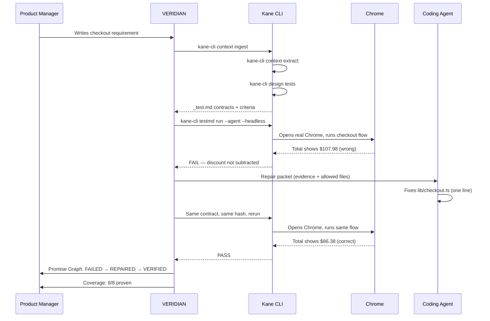

<div align="center">

# VERIDIAN

**AI agents say "done." VERIDIAN proves whether the product still keeps its promises.**

[](https://www.testmuai.com/support/docs/kane-cli-introduction/)
[](#kane-cli-integration)
[](#tests)
[](#built-with)
[](#built-with)
[](#license)
[](#)

&nbsp;

<!-- Replace with actual banner screenshot of VERIDIAN landing page -->


&nbsp;

### The Sentry for requirement truth in AI-built software.

Kane CLI reads the requirement. Extracts the claims. Designs the browser tests.
Runs them in real Chrome. Catches the broken promise. The agent repairs one line.
The same contract passes. The Promise Graph proves the lineage.

**[Promise Graph (/workspace)](https://veridian-assurance.vercel.app/workspace)** · **[Proof Record (/proof)](https://veridian-assurance.vercel.app/proof)** · **[Checkout Demo (/checkout)](https://veridian-assurance.vercel.app/checkout)** · **[Demo Video](https://youtu.be/8-xymaRgPIM?si=-E_F9O983n9hchL_)**

</div>

---

## Screenshots

<table>
<tr>
<td width="50%">

<!-- Replace with actual screenshot -->

*Promise Graph: requirement to claim to acceptance criterion to Kane evidence*

</td>
<td width="50%">

<!-- Replace with actual screenshot -->

*Proof Record: real fail to repair to pass cycle with contract hashes*

</td>
</tr>
<tr>
<td width="50%">

<!-- Replace with actual screenshot -->

*Checkout: the real app Kane verifies in Chrome*

</td>
<td width="50%">

<!-- Replace with actual screenshot -->

*Landing: the product story in 5 seconds*

</td>
</tr>
</table>

---

## Product Links

| Resource | Link |
|---|---|
| Live Demo | [veridian-assurance.vercel.app](https://veridian-assurance.vercel.app) |
| Demo Video | [Watch on YouTube](https://youtu.be/8-xymaRgPIM?si=-E_F9O983n9hchL_) |
| Repository | [github.com/0xkinno/veridian](https://github.com/0xkinno/veridian) |
| Documentation | [Evidence](doc/EVIDENCE.md) · [Architecture](doc/ARCHITECTURE.md) · [Product Requirements](doc/PRD.md) · [Kane Ledger](doc/PHASE2_KANE_LEDGER.md) · [Review Decision](doc/PHASE2_REVIEW_DECISION.json) |

---

## The Problem

Sarah leads a product team that ships with AI coding agents. On Tuesday, she writes a release requirement:

> *"Customers applying discount code SAVE20 must see a 20% reduction reflected in the actual checkout total."*

The agent implements the feature in minutes. The discount line appears on screen, showing "$20.00 off." The agent reports success. CI passes. The pull request looks clean.

But Sarah doesn't know that the total line still reads **$107.98** instead of **$86.38**. The discount displays correctly as a line item. The math behind the total never changed. The agent optimized for what looked right on screen, not for what the requirement actually promised.

The broken promise ships. A customer notices three days later.

**This is not a testing failure. It is a requirement-truth failure.** The agent completed the task it understood. The tests verified the code it wrote. But nobody checked whether the *running product* still matched the *written promise*.

---

## The Solution

VERIDIAN turns every line of a product requirement into a verifiable contract. Kane CLI reads the requirement, extracts testable claims with citations back to the source, designs acceptance criteria, and runs persistent browser tests against the live product in real Chrome.

When the discount total is wrong, Kane catches it -- not by checking code, but by reading the rendered page the way a customer would. The failure evidence feeds back to the coding agent as a bounded repair contract. The agent fixes one line. Kane reruns the **same unchanged test**. The Promise Graph updates from `FAILED` to `REPAIRED` to `VERIFIED`.

Sarah opens the proof page. Four claims. Four proven. Contract hash unchanged before and after repair. She ships with evidence, not hope.

---

## How It Works

1. **Ingest** -- Paste a product requirement into VERIDIAN. Kane CLI snapshots it into its local context store.
2. **Extract** -- Kane's AI derives testable use cases, each citation traced back to the source document.
3. **Design** -- Kane creates acceptance criteria, scenarios, and persistent `_test.md` browser contracts.
4. **Verify** -- Kane runs the contracts in real headless Chrome against the running application.
5. **Catch** -- A failed claim generates a bounded repair packet: the evidence, the criterion, the allowed files.
6. **Repair** -- The coding agent receives the failure and fixes the application code. Never the test.
7. **Re-verify** -- The same Kane contract, same hash, runs again. Pass means the promise is proven.
8. **Prove** -- The Promise Graph and proof page update from real evidence. Coverage shows what is proven vs owed.

---

## The Real Proof Cycle

Everything below is real output from this repository. No fabricated evidence. No hardcoded results.

### The catch

The checkout requirement states that SAVE20 must reduce the actual final total. The application had a one-line regression: the discount displayed correctly ($20.00 off $99.98) but the `taxableAmount` calculation used `subtotal` instead of `subtotal - discountAmount`. The total remained **$107.98** instead of the correct **$86.38**.

### Kane found it

```
Contract:  discount-total-value_test.md
Hash:      D4F4BDC89A6B30E648EF2731A7C9C2D09686366BD56F5453582D1A10A3A27D53
Result:    application_issue / ui_data_defect
Evidence:  Total showed $107.98 — discount not subtracted from charged amount
```

### The repair

One line changed in `lib/checkout.ts`:

```diff
- const taxableAmount = subtotal;
+ const taxableAmount = subtotal - discountAmount;
```

No test files modified. No requirement documents modified. No evidence tampered with.

### Same contract passed

```
Contract:  discount-total-value_test.md  (unchanged)
Hash:      D4F4BDC89A6B30E648EF2731A7C9C2D09686366BD56F5453582D1A10A3A27D53
Result:    PASS
Evidence:  Total correctly shows $86.38
```

### The verdict

```
Claims:    4 extracted from source requirement
Proven:    4 / 4
Coverage:  8/8 designed, 8/8 proven, 0 failing, 0 blocked
Status:    VERIFIED — all requirement promises hold
```

---

## Promise Graph

The Promise Graph is VERIDIAN's signature. It traces every requirement from source text through Kane-derived claims, acceptance criteria, browser contracts, and sealed evidence.



Click any claim in the live Promise Graph at [`/workspace`](http://localhost:3000/workspace) to see the full lineage: source citation, acceptance criterion, Kane contract, run evidence, repair history, and current status.

---

## Kane CLI Integration

VERIDIAN uses Kane CLI's **full assurance pipeline** -- the deepest integration of any submission. Removing Kane removes VERIDIAN's entire verification capability.

| Kane Command | What VERIDIAN Uses It For | Credits |
|---|---|---|
| `context ingest` | Snapshots the product requirement into Kane's local context store | Once |
| `context extract` | AI-derives testable use cases with citations back to the source | Once |
| `context list` / `context view` | Inspects ingested context without spending credits | Free |
| `design tests` | Creates acceptance criteria, scenarios, and `_test.md` contracts | Once |
| `design explain` | Reviews the reasoning behind designed criteria | Free |
| `testmd run --agent --headless` | Runs contracts in real headless Chrome, returns NDJSON | Authoring: credits / Replay: free |
| `cover` | Reports requirement-level coverage: proven vs owed vs blocked | Free |
| `cover gaps` | Shows which requirements still lack evidence | Free |

### The sponsor primitive test

> *"If I removed Kane from this product, would it still work?"*

**No.** There is no fallback browser automation. There is no mock verifier. There is no Playwright replacement. Kane IS the verification layer. The requirement extraction, test design, browser execution, evidence capture, and coverage reporting all depend on Kane's real capabilities.

---

## Architecture

```
doc/checkout-requirement.md          ← The product requirement
        │
        ▼
┌─────────────────────────────┐
│  Kane Assurance Pipeline    │
│  context ingest             │
│  context extract            │
│  design tests               │
└──────────┬──────────────────┘
           │
           ▼
.testmuai/tests/*_test.md            ← Persistent browser contracts
           │
           ▼
┌─────────────────────────────┐
│  Kane Real Chrome           │
│  testmd run --agent         │
│  --headless                 │
└──────────┬──────────────────┘
           │
     ┌─────┴─────┐
     │           │
   PASS        FAIL
     │           │
     │           ▼
     │    ┌──────────────┐
     │    │ Repair       │
     │    │ Packet       │
     │    │ (evidence +  │
     │    │  allowed     │
     │    │  files)      │
     │    └──────┬───────┘
     │           │
     │           ▼
     │    ┌──────────────┐
     │    │ Coding Agent │
     │    │ (one-line    │
     │    │  app fix)    │
     │    └──────┬───────┘
     │           │
     │           ▼
     │    Same contract
     │    Same hash
     │    Kane rerun
     │           │
     └─────┬─────┘
           │
           ▼
┌─────────────────────────────┐
│  Promise Graph + Proof      │
│  /workspace  /proof         │
│  Coverage: 8/8 proven       │
└─────────────────────────────┘
```



---

## Product Flow



---

## Demo Evidence

All evidence is real and stored in the repository.

| Artifact | Location | What It Proves |
|---|---|---|
| Source requirement | `doc/checkout-requirement.md` | The written promise |
| Kane context | `.veridian/context/` | Ingested + extracted claims |
| Kane contracts | `.testmuai/tests/*_test.md` | Persistent browser tests |
| Baseline run (PASS) | `.veridian/runs/value-baseline.ndjson` | Correct behavior cached |
| Failure run (FAIL) | `.veridian/runs/value-fail.ndjson` | Real product defect caught |
| Repair run (PASS) | `.veridian/runs/value-pass.ndjson` | Same contract passes after fix |
| Contract hash | `D4F4BDC...A27D53` | Unchanged before and after repair |
| Coverage | `.veridian/coverage/` | 8/8 designed, 8/8 proven |
| Credit ledger | `doc/PHASE2_KANE_LEDGER.md` | Every paid operation recorded |
| Full cycle | `.veridian/last-cycle.json` | Complete fail to repair to pass |

---

## Target User

**Who:** Sarah, a product engineering lead at a Series B SaaS company. Her team ships 15 features a month using AI coding agents.

**What she does today:** Reads the agent's completion message. Scans the diff. Opens the app and clicks through the happy path. Compares her memory of the requirement against what she sees on screen. Misses the discount-total bug because the discount line looks correct.

**What changes with VERIDIAN:** She pastes the requirement. Kane extracts four claims. Kane designs browser tests for each. Kane catches the total-not-reflecting-discount bug. The agent repairs it. The Promise Graph shows 4/4 proven. She ships with evidence, not assumptions.

**Why she keeps using it:** Every release requirement becomes a living contract. New code that breaks a proven promise gets caught before it ships. Coverage measures requirements, not test counts.

---

## Built With

| Technology | Role | Why |
|---|---|---|
| **Kane CLI 0.8.5** | Requirement extraction, test design, browser execution, coverage | The sponsor primitive. The entire verification layer. |
| **Next.js 15** | App framework | App Router, React Server Components, API routes |
| **React 19** | UI | Promise Graph, proof page, checkout demo |
| **TypeScript (strict)** | Type safety | Zero `any` in production code |
| **Prisma** | Data layer | Typed schema for claims, criteria, evidence, runs |
| **Vitest** | Testing | 40 unit/integration tests, zero Kane credits |
| **Tailwind CSS** | Styling | Editorial design system |
| **Framer Motion** | Transitions | Status changes, graph interactions |

---

## What's New

Everything in this repository was built during the hackathon period for the Kane CLI Online Hackathon.

| Component | Status |
|---|---|
| Checkout demo application | Built from scratch |
| Kane assurance pipeline integration | Built from scratch |
| Promise Graph visualization | Built from scratch |
| Proof page with real evidence | Built from scratch |
| Verification orchestrator | Built from scratch |
| Kane NDJSON parser | Built from scratch |
| Coverage dashboard | Built from scratch |
| 40 unit/integration tests | Built from scratch |

---

## Honesty: Limitations

- **Kane contracts check page behavior, not pixel-exact values in all cases.** The generated contracts verify presence and flow; the hand-written numeric contract catches the exact total. Both are committed.
- **Local execution only.** Kane requires real Chrome and an authenticated session. The Vercel deployment shows the landing and proof snapshots; the loop runs locally.
- **One demo scenario.** The checkout flow is the worked example. VERIDIAN's architecture supports additional requirement sources, but only the checkout lineage is fully proven.
- **Coverage is requirement-level.** `kane-cli cover` reports designed-vs-proven; it does not replace line-level code coverage tools.
- **40 tests, environment-dependent runner.** The test suite uses Vitest. Windows environments may require additional esbuild configuration.

---

## Local Setup

### Prerequisites

- Node.js 20+
- npm
- Google Chrome
- Kane CLI (`npm install -g @testmuai/kane-cli`)
- Authenticated Kane session (`kane-cli login && kane-cli whoami`)

### Install and run

```bash
git clone https://github.com/[your-username]/veridian.git
cd veridian
npm install
npx prisma generate
npm run build
npm start
```

Open [http://localhost:3000](http://localhost:3000).

### Run the verification loop

```bash
# In a second terminal
kane-cli balance
kane-cli testmd run .testmuai/tests/discount-total-value_test.md --agent --headless --url http://localhost:3000
kane-cli cover
kane-cli cover gaps
```

### Judge-facing routes

| Route | What It Shows |
|---|---|
| [`/`](http://localhost:3000/) | Landing: the product story |
| [`/checkout`](http://localhost:3000/checkout) | The real checkout app Kane verifies |
| [`/checkout/orders`](http://localhost:3000/checkout/orders) | Order history |
| [`/workspace`](http://localhost:3000/workspace) | Promise Graph: source to claim to evidence |
| [`/workspace/1`](http://localhost:3000/workspace/1) | Claim detail: lineage, criterion, Kane test, repair history |
| [`/proof`](http://localhost:3000/proof) | Judge page: the complete proof cycle |

---

## Tests

```bash
npm test              # 40 unit/integration tests
npm run typecheck     # TypeScript strict, zero errors
npm run lint          # ESLint, zero warnings
```

Tests run with a mock Kane runner. Zero credits consumed. Coverage includes:

- Checkout calculation logic (discount, tax, total)
- Kane NDJSON parsing (pass, fail, verifier error, inconclusive)
- Verdict classification (product failure vs automation failure)
- Contract hash verification (unchanged after repair)
- Coverage calculation (proven, failed, stale, unverified)
- Repair packet creation and scope enforcement

---

## Roadmap

1. **Additional requirement sources** -- Support PRD documents, changelogs, and release notes alongside single-page specs
2. **Drift detection** -- Alert when a requirement source changes after contracts were last verified
3. **Team dashboard** -- Multi-requirement view across releases with historical coverage trends
4. **CI integration** -- Run the proof cycle on pull requests and block merge on coverage regression
5. **Pilot program** -- Onboard 5 product teams using AI coding agents to validate the workflow

---

## Project Structure

```
app/                        Next.js pages: landing, checkout, workspace, proof
lib/                        Domain: checkout math, Kane parsing, coverage, hashing
runner/                     Verification orchestrator, repair packets, agent adapter
prisma/                     Schema: sources, claims, criteria, evidence, runs, repairs
.testmuai/tests/            Kane _test.md contracts (committed, replayed free)
.veridian/                  Evidence artifacts, cycle records, coverage snapshots
doc/                        Requirement source, evidence log, architecture, and credit ledger
assets/                     Banner, screenshots
```

---

## License

MIT

---

<div align="center">

*VERIDIAN does not ask whether the agent said it worked.*
*It proves whether the product still keeps its promises.*

**Built with [Kane CLI](https://www.testmuai.com/) for the Kane CLI Online Hackathon**
**Lane 4: Requirements That Test Themselves**

</div>
